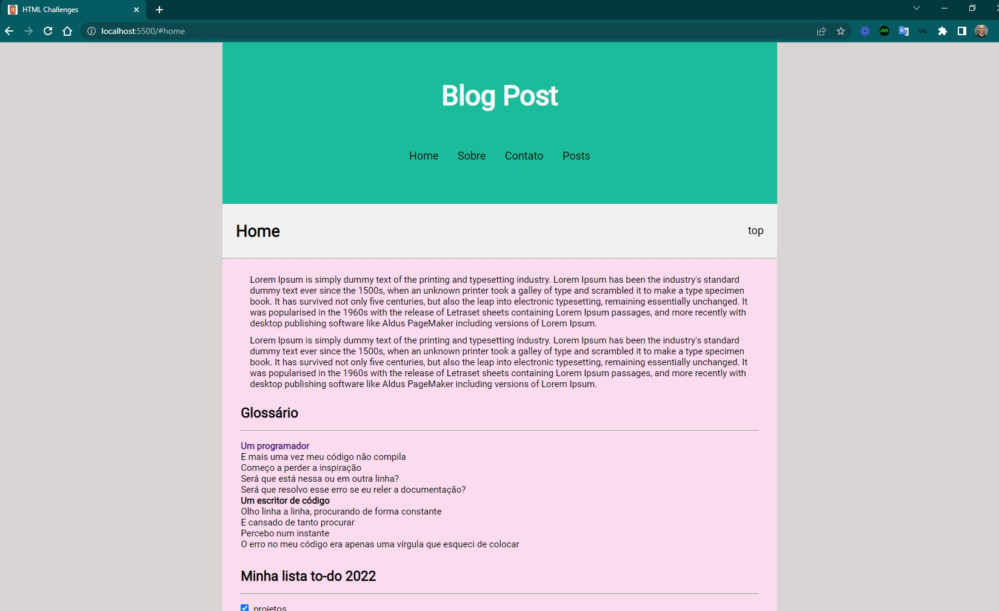

<h4 align="center"> 
	🚧 HTML challenges 🚀
</h4>

<p align="center" style="display: flex; align-items: flex-start; justify-content: center;">
  
</p>  

### 💻 Sobre o desafio

Essa é uma série de desafios básicos para que você possa praticar seus conhecimentos em HTML. Teste suas habilidades nas tags HTML mais utilizadas no dia a dia do Desenvolvimento Web.

#### 💻 Techs

- Nível de dificuldade: Iniciante
- Tecnologias: html, css

#### 💻 Como começar?

1 - Use os links para fazer os desafios como base para o projeto. Também disponibilizamos para download todos os assets necessários (imagens e ícones), para fazer o download basta clicar no link acima.  

2 - Leia com atenção todas as instruções do desafio.

3 - Bora codar! Lembre-se que você pode usar as tecnologias que se sentir mais confortável, mas também pode se desafiar usando novas techs, fazendo modificações e/ou adicionando funcionalidades no projeto como preferir. 🚀

4 - Compartilhe seu resultado ou tire suas dúvidas na nossa [**comunidade aberta**](https://discord.gg/bacwY2gDCF)

### 💡 Conteúdos Aplicados

Essa é uma série de desafios básicos para que você possa praticar seus conhecimentos em HTML. 

#### 💡 [Guia Estelar de HTML](https://app.rocketseat.com.br/discover/course/o-guia-estelar-de-html)
O conteúdo esclarece plugin de preview HTML, tags, atributos, semântica, listas, abreviações, listas, representação de código, URLs, diretórios, tabelas, THead, TBody, colgroup, cabeçalho, meta, favicon, meta SEO e meta social.

### 🚀 [Requisitos do projeto](https://efficient-sloth-d85.notion.site/Desafios-HTML-ed0f6368d34d44ffab92686b9dc93229)

#### 🚀 Requisitos para o desafio 

- [ ] 1. [Glossário](https://efficient-sloth-d85.notion.site/1-Gloss-rio-03e398f3c3e642b0a17c344aa354601f)
- [ ] 2. [Formulário de contato](https://efficient-sloth-d85.notion.site/2-Formul-rio-de-contato-7bb047fc602f48a1859e02882ddd547b)
- [ ] 3. [Lista de Compras](https://efficient-sloth-d85.notion.site/3-Lista-de-compras-91ff11e5af754cb48b51ff56e272a89d)
- [ ] 4. [Quiz](https://efficient-sloth-d85.notion.site/4-Quiz-46ee27c74c00436db6368b3855ee7dbc)
- [ ] 5. [Blog Post](https://efficient-sloth-d85.notion.site/5-Blog-Post-46d74c84a63c4e628739cc8a4fa7898f)

### 📅 Entregas

Após concluí-los, adicionar esses códigos ao seu Github é uma boa forma de demonstrar seus conhecimentos para oportunidades futuras.

#### 📅 1. Glossário

##### Sobre o desafio

Nesse desafio você deve criar um glossário com com no mínimo 4 tags HTML e suas definições.

##### Iniciando o projeto

Primeiro vamos criar o arquivo HTML. Você pode dar qualquer nome para este arquivo, desde que use a extensão `.html`. Exemplo: **glossary.html** 

Para criar a estrutura base do HTML no Visual Studio Code, você pode digitar `!` e `TAB` em seguida. Feito isso, você vai ficar com uma estrutura parecida com o código abaixo:

````html
<!DOCTYPE html>
<html lang="en">
  <head>
    <meta charset="UTF-8" />
    <meta http-equiv="X-UA-Compatible" content="IE=edge" />
    <meta name="viewport" content="width=device-width, initial-scale=1.0" />
    <title>Glossário</title>
  </head>
  <body>

  </body>
</html>
````

Lembre-se de dar um título para o documento usando a tag <title> 
<title>Glossário</title>

##### Criando uma lista de descrição

❓ [Adicione um título para a página](https://app.rocketseat.com.br/node/o-guia-estelar-de-html/group/trabalhando-com-elementos/lesson/titulos-e-paragrafos)

❓ Para criar o glossário, você deve usar uma [lista de descrição](https://app.rocketseat.com.br/node/o-guia-estelar-de-html/group/trabalhando-com-elementos/lesson/lista-de-descricao) (`<dl>`)
    
❓ O termo da descrição deve estar em **negrito**. Bônus: o termo da descrição pode ser um link que leva para a documentação sobre o elemento HTML

##### Como deve ficar a página ao final?

Ao finalizar o desafio você vai ter um resultado parecido com o da imagem abaixo. 

Lembrando que as imagens e textos abaixo são ilustrativos e você pode adicionar seu próprio conteúdo conforme as instruções acima.

#### 📅 2.

- detalhes

#### 📅 3.

- detalhes

#### 📅 4.

- detalhes

#### 📅 5.

- detalhes

#### 📅 Tarefas

- [ ] Organizando os detalhes do projeto no readme.md
- [ ] Uma branch main e uma developer
- [ ] Favicon
- [ ] Cor do ícone
- [ ] [Learn Responsive Design](https://web.dev/learn/design/)
- [ ] [Learn CSS](https://web.dev/learn/css/)

#### 📅 Telas

- Desktop

<p align="center" style="display: flex; align-items: flex-start; justify-content: center;">
  
</p>  

- Mobile

<p align="center" style="display: flex; align-items: flex-start; justify-content: center;">
  
</p>  

Feito com ❤️ por Douglas A B Novato. 👋🏽 [Entre em contato!](https://www.linkedin.com/in/douglasabnovato/)
 
Fonte do projeto na [Rocketseat](https://www.rocketseat.com.br/). 👋 Participe da [comunidade aberta](https://discord.gg/bacwY2gDCF)!