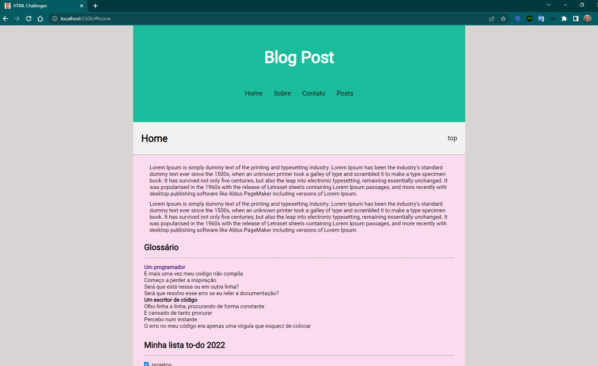
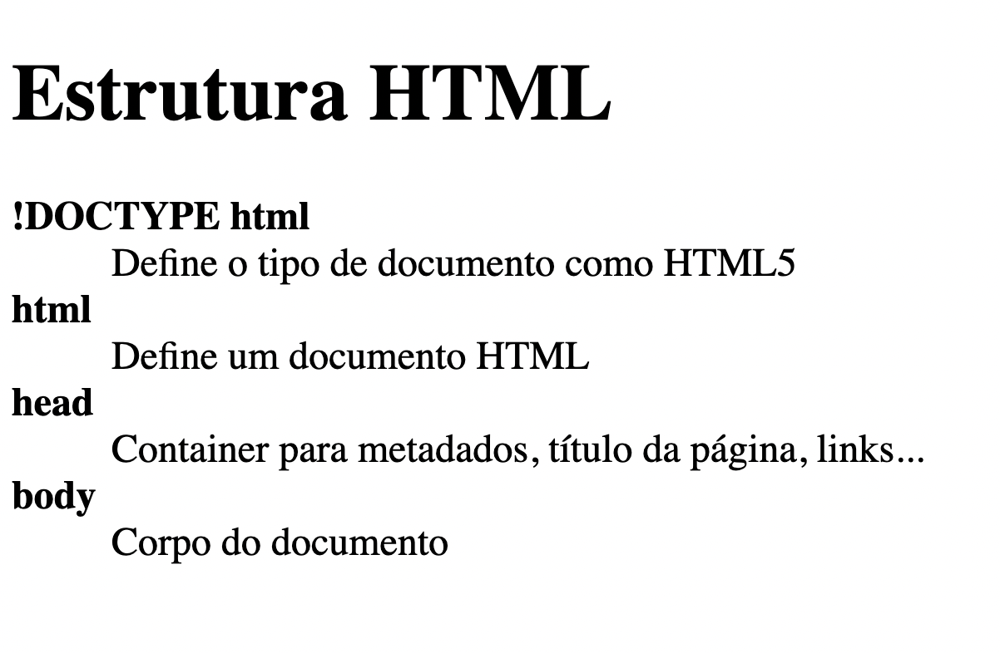
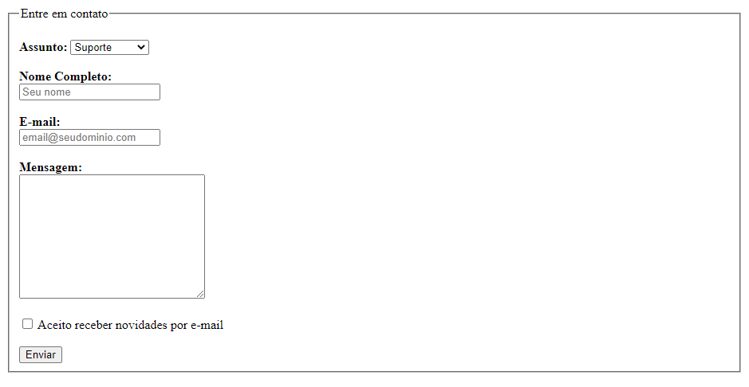
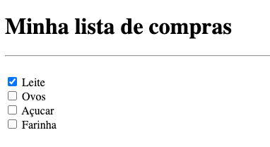
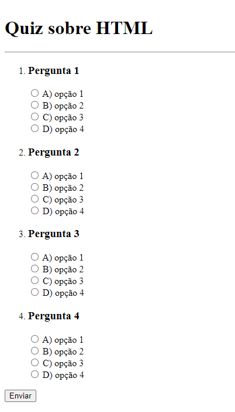
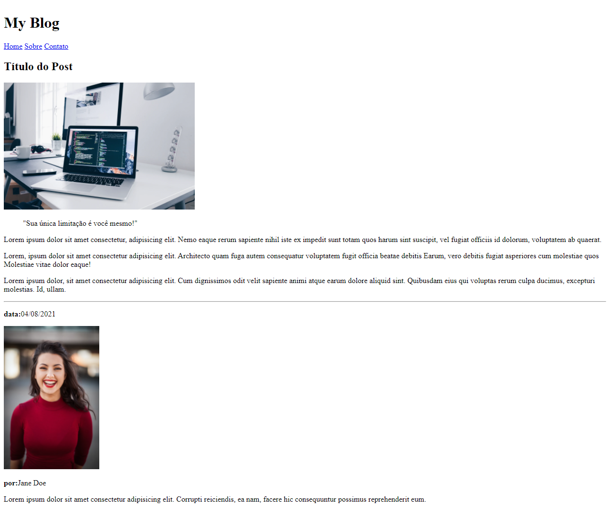
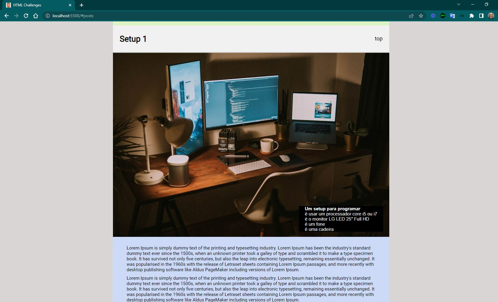
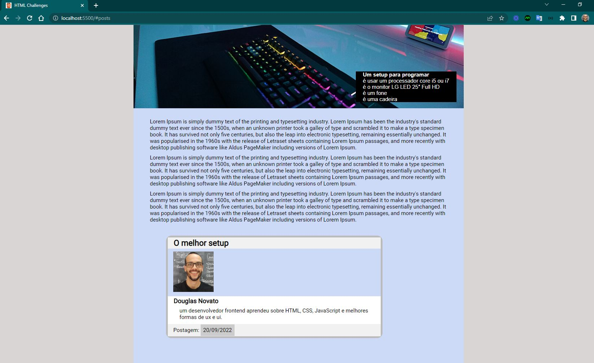

<h4 align="center"> 
	🚧 HTML challenges 🚀
</h4>

<p align="center" style="display: flex; align-items: flex-start; justify-content: center;">
  
</p>  

### 💻 Sobre o desafio

Essa é uma série de desafios básicos para que você possa praticar seus conhecimentos em HTML. Teste suas habilidades nas tags HTML mais utilizadas no dia a dia do Desenvolvimento Web.

#### 💻 Techs

- Nível de dificuldade: Iniciante
- Tecnologias: html, css

#### 💻 Como começar?

1 - Use os links para fazer os desafios como base para o projeto. Também disponibilizamos para download todos os assets necessários (imagens e ícones), para fazer o download basta clicar no link acima.  

2 - Leia com atenção todas as instruções do desafio.

3 - Bora codar! Lembre-se que você pode usar as tecnologias que se sentir mais confortável, mas também pode se desafiar usando novas techs, fazendo modificações e/ou adicionando funcionalidades no projeto como preferir. 🚀

4 - Compartilhe seu resultado ou tire suas dúvidas na nossa [**comunidade aberta**](https://discord.gg/bacwY2gDCF)

### 💡 Conteúdos Aplicados

Essa é uma série de desafios básicos para que você possa praticar seus conhecimentos em HTML. 

#### 💡 [Guia Estelar de HTML](https://app.rocketseat.com.br/discover/course/o-guia-estelar-de-html)
O conteúdo esclarece plugin de preview HTML, tags, atributos, semântica, listas, abreviações, listas, representação de código, URLs, diretórios, tabelas, THead, TBody, colgroup, cabeçalho, meta, favicon, meta SEO e meta social.

### 🚀 [Requisitos do projeto](https://efficient-sloth-d85.notion.site/Desafios-HTML-ed0f6368d34d44ffab92686b9dc93229)

#### 🚀 Requisitos para o desafio 

- [x] 1. [Glossário](https://efficient-sloth-d85.notion.site/1-Gloss-rio-03e398f3c3e642b0a17c344aa354601f)
- [x] 2. [Formulário de contato](https://efficient-sloth-d85.notion.site/2-Formul-rio-de-contato-7bb047fc602f48a1859e02882ddd547b)
- [x] 3. [Lista de Compras](https://efficient-sloth-d85.notion.site/3-Lista-de-compras-91ff11e5af754cb48b51ff56e272a89d)
- [x] 4. [Quiz](https://efficient-sloth-d85.notion.site/4-Quiz-46ee27c74c00436db6368b3855ee7dbc)
- [x] 5. [Blog Post](https://efficient-sloth-d85.notion.site/5-Blog-Post-46d74c84a63c4e628739cc8a4fa7898f)

### 📅 Entregas

Após concluí-los, adicionar esses códigos ao seu Github é uma boa forma de demonstrar seus conhecimentos para oportunidades futuras.

#### 📅 1. Glossário

##### Sobre o desafio

Nesse desafio você deve criar um glossário com com no mínimo 4 tags HTML e suas definições.

##### Iniciando o projeto

Primeiro vamos criar o arquivo HTML. Você pode dar qualquer nome para este arquivo, desde que use a extensão `.html`. Exemplo: **glossary.html** 

Para criar a estrutura base do HTML no Visual Studio Code, você pode digitar `!` e `TAB` em seguida. Feito isso, você vai ficar com uma estrutura parecida com o código abaixo:

````html
<!DOCTYPE html>
<html lang="en">
  <head>
    <meta charset="UTF-8" />
    <meta http-equiv="X-UA-Compatible" content="IE=edge" />
    <meta name="viewport" content="width=device-width, initial-scale=1.0" />
    <title>Glossário</title>
  </head>
  <body>

  </body>
</html>
````

Lembre-se de dar um título para o documento usando a tag <title>: `<title>Glossário</title>`

##### Criando uma lista de descrição

❓ [Adicione um título para a página](https://app.rocketseat.com.br/node/o-guia-estelar-de-html/group/trabalhando-com-elementos/lesson/titulos-e-paragrafos)

❓ Para criar o glossário, você deve usar uma [lista de descrição](https://app.rocketseat.com.br/node/o-guia-estelar-de-html/group/trabalhando-com-elementos/lesson/lista-de-descricao) (`<dl>`)
    
❓ O termo da descrição deve estar em **negrito**. Bônus: o termo da descrição pode ser um link que leva para a documentação sobre o elemento HTML

##### Como deve ficar a página ao final?

Ao finalizar o desafio você vai ter um resultado parecido com o da imagem abaixo. 



Lembrando que as imagens e textos abaixo são ilustrativos e você pode adicionar seu próprio conteúdo conforme as instruções acima.

#### 📅 2. Formulário de contato

##### Sobre o desafio

Nesse desafio você vai criar um formulário para contato.

Para esse desafio, recomendamos que você assista ao curso [Formulários de Outro Planeta](https://app.rocketseat.com.br/node/formularios-de-outro-planeta), caso ainda não tenha assistido.

##### Iniciando o projeto

Primeiro vamos criar o arquivo HTML. Você pode dar qualquer nome para este arquivo, desde que use a extensão `.html`. Exemplo: **contato.html** 

Para criar a estrutura base do HTML no Visual Studio Code, você pode digitar `!` e `TAB` em seguida. Feito isso, você vai ficar com uma estrutura parecida com o código abaixo:

````html
<!DOCTYPE html>
<html lang="en">
  <head>
    <meta charset="UTF-8" />
    <meta http-equiv="X-UA-Compatible" content="IE=edge" />
    <meta name="viewport" content="width=device-width, initial-scale=1.0" />
    <title>Contato</title>
  </head>
  <body>

  </body>
</html>
````

Lembre-se de dar um título para o documento usando a tag <title>: `<title>Contato</title>`

##### Criando o formulário
💡
- Dentro do formulário adicione um `fieldset` com `legend` "Entre em contato"
- Adicione um `select` para que o usuário possa escolher o assunto do contato (ex: suporte, sugestão e reclamação)
- Adicione campos para que o usuário possa escrever seu **nome completo** e **e-mail**
    - Lembre-se de usar o `type` correto para cada tipo de input
- Adicione uma área de texto para que o usuário possa enviar uma **mensagem**
- Adicione um campo com um `checkbox` e o texto "Aceito receber novidades por e-mail"
- O formulário deve ter um botão "Enviar"
- Para adicionar quebra de linha, você pode usar a tag `<br>` 
[https://developer.mozilla.org/pt-BR/docs/Web/HTML/Element/br](https://developer.mozilla.org/pt-BR/docs/Web/HTML/Element/br)

##### Como deve ficar a página ao final?

Ao finalizar o desafio você vai ter um resultado parecido com o da imagem abaixo. 



Lembrando que as imagens e textos abaixo são ilustrativos e você pode adicionar seu próprio conteúdo conforme as instruções acima.

#### 📅 3. Lista de compras

##### Sobre o desafio

Nesse exercício você deve criar uma lista de compras que tenha no mínimo 4 itens. 

Pode ser uma lista de compras de mercado, uma lista de itens que você deseja comprar, ou qualquer outro tipo de lista de compras.

##### Iniciando o projeto

Primeiro vamos criar o arquivo HTML. Você pode dar qualquer nome para este arquivo, desde que use a extensão `.html`. Exemplo: **shopping-list.html** 

Para criar a estrutura base do HTML no Visual Studio Code, você pode digitar `!` e `TAB` em seguida. Feito isso, você vai ficar com uma estrutura parecida com o código abaixo:

````html
<!DOCTYPE html>
<html lang="en">
  <head>
    <meta charset="UTF-8" />
    <meta http-equiv="X-UA-Compatible" content="IE=edge" />
    <meta name="viewport" content="width=device-width, initial-scale=1.0" />
    <title>Lista de Compras</title>
  </head>
  <body>

  </body>
</html>
````

Lembre-se de dar um título para o documento usando a tag <title>: `<title>Contato</title>`

##### Criando a lista
💡
- ❓ A página deve ter um Título `h1` e um separador (`hr`) logo abaixo
- ❓ Cada item da lista deve ser um input do tipo `checkbox`
- ❓ O primeiro item deve estar marcado como - `checked`
- ❓ [Veja essa aula sobre checkbox](https://app.rocketseat.com.br/node/formularios-de-outro-planeta/group/tags-de-entrada-de-dados/lesson/checkbox)

##### Como deve ficar a página ao final?

Ao finalizar o desafio você vai ter um resultado parecido com o da imagem abaixo. 



Lembrando que as imagens e textos abaixo são ilustrativos e você pode adicionar seu próprio conteúdo conforme as instruções acima.
 
#### 📅 4. Lista de Compras

##### Sobre o desafio

Nesse desafio você deve criar um quiz de perguntas e respostas. 

Adicione no mínimo 3 perguntas com 4 opções de respostas cada. 

Você pode escolher qual o tema do quiz.

##### Iniciando o projeto

Primeiro vamos criar o arquivo HTML. Você pode dar qualquer nome para este arquivo, desde que use a extensão `.html`. Exemplo: **quiz.html** 

Para criar a estrutura base do HTML no Visual Studio Code, você pode digitar `!` e `TAB` em seguida. Feito isso, você vai ficar com uma estrutura parecida com o código abaixo:

````html
<!DOCTYPE html>
<html lang="en">
  <head>
    <meta charset="UTF-8" />
    <meta http-equiv="X-UA-Compatible" content="IE=edge" />
    <meta name="viewport" content="width=device-width, initial-scale=1.0" />
    <title>Quiz</title>
  </head>
  <body>

  </body>
</html>
````

Lembre-se de dar um título para o documento usando a tag <title>: `<title>Contato</title>`

##### Criando o Quiz 

💡 Quiz é um jogo de perguntas e respostas. Uma forma simples de criar um quiz, é adicionando um formulário, e usar a lista ordenada para criar as perguntas e inputs do tipo radio para as opções de respostas.

- ❓ Primeiro você pode adicionar um formulário na página
````html
<form action="">
   <!-- Aqui você vai adicionar as perguntas e opções de respostas -->
</form>
````
- 💡 Não precisa se preocupar com os atributos do form pois, nesse momento, vamos focar apenas na estrutura HTML do quiz e o mesmo não precisa ser enviado.

- ❓ Listando as perguntas e respostas
````html
<ol>
  <li>
    <h3>Pergunta 1</h3>
    <div>
      <input type="radio" name="question-1" id="question-1-a" value="A" />
      <label for="question-1-a">A) opção 1</label>
    </div>
    <div>
      <input type="radio" name="question-1" id="question-1-b" value="B" />
      <label for="question-1-b">B) opção 2</label>
    </div>
    <div>
      <input type="radio" name="question-1" id="question-1-c" value="C" />
      <label for="question-1-c">C) opção 3</label>
    </div>
    <div>
      <input type="radio" name="question-1" id="question-1-d" value="D" />
      <label for="question-1-d">D) opção 4</label>
    </div>
  </li>
<!-- Adicionar as outras perguntas dentro de um li -->
</ol>
````

- ❓ Aula sobre [listas](https://app.rocketseat.com.br/node/o-guia-estelar-de-html/group/trabalhando-com-elementos/lesson/listas)
- ❓ Aula sobre [Input type="radio"](https://app.rocketseat.com.br/node/formularios-de-outro-planeta/group/tags-de-entrada-de-dados/lesson/radio)

##### Como deve ficar a página ao final?

Ao finalizar o desafio você vai ter um resultado parecido com o da imagem abaixo. 



Lembrando que as imagens e textos abaixo são ilustrativos e você pode adicionar seu próprio conteúdo conforme as instruções acima.

#### 📅 5. Blog Post

##### Sobre o desafio

Nesse desafio você deve criar a estrutura HTML para a página de post de um blog.

##### Iniciando o projeto

Primeiro vamos criar o arquivo HTML, você pode dar qualquer nome para este arquivo, desde que use a extensão `.html`. Exemplo: **blog-post.html** 

Para criar a estrutura base do HTML no Visual Studio Code, você pode digitar `!` e `TAB` em seguida. Feito isso, você vai ficar com uma estrutura parecida com o código abaixo:

````html
<!DOCTYPE html>
<html lang="en">
  <head>
    <meta charset="UTF-8" />
    <meta http-equiv="X-UA-Compatible" content="IE=edge" />
    <meta name="viewport" content="width=device-width, initial-scale=1.0" />
    <title>Document</title>
  </head>
  <body>

  </body>
</html>
````

Lembre-se de dar um título para o documento usando a tag <title>: `<title>Glossário</title>`

##### Criando um blog post

Nessa seção você vai encontrar as instruções e dicas para resolver o desafio.

Então, bora codar! 👨‍💻👩‍💻

❓ Adicione um header com o nome do blog em negrito e adicione links para páginas "Home", "Sobre" e "Contato". Os links não precisam levar para nenhuma página, para isso basta adicionar um # no href da tag a, [tag âncora](https://app.rocketseat.com.br/node/o-guia-estelar-de-html/group/links/lesson/conhecendo-a-tag-ancora).

❓ O post do blog deve ficar dentro da tag article. Nesse curso, você pode ver mais sobre como deixar o [HTML semântico](https://app.rocketseat.com.br/node/html-que-faz-sentido-para-todos). E aqui neste outro pode ver mais sobre a [tag article](https://app.rocketseat.com.br/node/html-que-faz-sentido-para-todos/lesson/article)

##### A estrutura do post

- Adicione um [título](https://app.rocketseat.com.br/node/o-guia-estelar-de-html/group/trabalhando-com-elementos/lesson/titulos-e-paragrafos) para o post.

###### O post deve ter

- Uma imagem:

❓ Para que a [imagem](https://app.rocketseat.com.br/node/o-guia-estelar-de-html/group/conceitos-7/lesson/atributos) não fique muito grande, você pode usar o atributo width adicionando uma largura de 400px, por exemplo width="400px" 

❓ Imagens no [HTML](https://app.rocketseat.com.br/node/posso-ver-e-ouvir-o-html/group/images/lesson/images)

❓ Sites onde você pode encontrar imagens grátis para usar nos seus projetos: [Unsplash](https://unsplash.com/), [Pexels](https://www.pexels.com/pt-br/), [Pixabay](https://pixabay.com/pt/).

- Adicione uma [citação](https://app.rocketseat.com.br/node/o-guia-estelar-de-html/group/trabalhando-com-elementos/lesson/citacoes)

- Crie mínimo 3 parágrafos (você pode usar o `lorem` para criar o texto dos parágrafos)
- Adicione também um separador `<hr>`
- Adicione um `aside` com as informações sobre o autor do post
    - data da postagem
    - adicione uma imagem do autor
    - nome do autor
    - um [pequeno texto](https://app.rocketseat.com.br/node/html-que-faz-sentido-para-todos/lesson/aside) sobre o autor

##### Como deve ficar a página ao final?

Ao finalizar o desafio você vai ter um resultado parecido com o da imagem abaixo. 



Lembrando que as imagens e textos abaixo são ilustrativos e você pode adicionar seu próprio conteúdo conforme as instruções acima.

#### 📅 Tarefas

- [x] Organizando os detalhes do projeto no readme.md
- [x] Uma branch main e uma developer
- [x] Favicon
- [ ] [Learn Responsive Design](https://web.dev/learn/design/)
- [ ] [Learn CSS](https://web.dev/learn/css/)

#### 📅 Telas

- Desktop

<p align="center" style="display: flex; align-items: flex-start; justify-content: center;">
  
  
  
</p> 

Feito com ❤️ por Douglas A B Novato. 👋🏽 [Entre em contato!](https://www.linkedin.com/in/douglasabnovato/)
 
Fonte do projeto na [Rocketseat](https://www.rocketseat.com.br/). 👋 Participe da [comunidade aberta](https://discord.gg/bacwY2gDCF)!